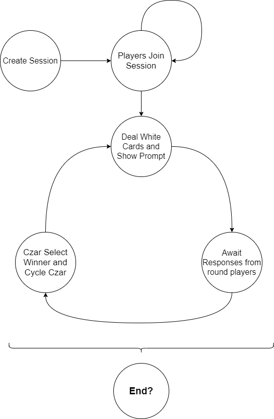

# Cards Against Humanity&reg; Online (CAHO)

## A little introduction

So, the pandemic was really boring... and I wanted to play a game with friends. While I am aware that there are certain services that offer the Cards Against Humanity&reg; as an online/browser experience, I figured I could also learn NodeJS (and vanilla JavaScript) more properly as well as websocket handling with Socket.IO. And that's exactly what Cards Against Humanity&reg; Online (a bad use of the 'XYZ Online' standard that I personally ripped off from SAO) is.

## Technical details

The NodeJS backend uses an ExpressJS server with websockets provided by Socket.IO. The frontend is vanilla HTML, CSS and JavaScript, though perhaps a future version could benefit from a framework like React. This is a stateless server, where only a user's username and socket information is stored for their current session.  

Each user can either create a room or join one using a 8-character long alphanumeric room ID generated when a room is created. The ID is supposed to be unique with respect to the number of expected rooms (not very many) as it uses the JavaScript Math.random function.  

The socket ID of the user is used as the primary identification for client-server communication, however, the uniqueness of usernames is also required, i.e. if you try to have two users with the same name join the same room, the second user to do so will be stopped from joining that session with a "duplicate user" error. This is to prevent confusion in the in-game chat as well as messages to users at the end of each round.  

The game's state machine is simple, please see below. It doesn't currently contain an 'end game' state since Cards Against Humanity&reg; can go on perpetually; ideally players would choose a stopping point and have a look at the leaderboard as required.

Currently, the game only supports the Base game and the 6 expansions. For now this is hard coded, but an upcoming feature would allow users to turn certain expansions on and off, including several packs beyond the original 6 expansions.

## Acknowledgements

The idea came to me after watching a tutorial on a Socket.IO based chat system in [this video by Traversy Media](https://www.youtube.com/watch?v=jD7FnbI76Hg).  The boilerplate code was largely identical to the content here.

The [JSON Against Humanity](https://crhallberg.com/cah/) Project for sourcing the card information, and also letting users know it's legal to use the cards.  
